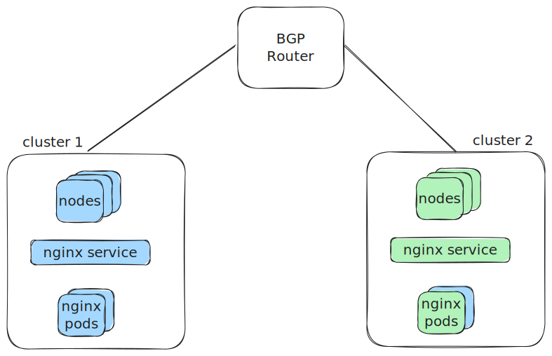

# BGP Control Plane

This is a demonstration of using Cilium BGP Control Plane (BGP CP) to advertise
routes to an external BGP speaking router and route between two clusters. Each
cluster does the following:

1. Runs 2 nginx pods managed as a deployment.
2. Exposes the nginx pods as a service.
3. Uses a Cilium IP pool to assign an external IP to services.
4. Advertises the nginx service using BGP CP.

### Demo Topology



## Dependencies
1. [kubectl](https://kubernetes.io/docs/tasks/tools/)
2. [kind](https://kind.sigs.k8s.io/)
3. [helm](https://helm.sh/docs/intro/install/)
4. [cilium-cli](https://github.com/cilium/cilium-cli)
5. `git clone https://github.com/danehans/cilium-demos.git && cd cilium-demos/bgp-cp`

## Install the Kubernetes clusters

Use kind to create the first cluster:

```sh
$ kind create cluster --config - <<EOF
kind: Cluster
apiVersion: kind.x-k8s.io/v1alpha4
networking:
  disableDefaultCNI: true   # do not install kindnet
  kubeProxyMode: none       # do not run kube-proxy
  podSubnet: "10.241.0.0/16"
  serviceSubnet: "10.11.0.0/16"
name: cilium
nodes:
- role: control-plane
- role: worker
- role: worker
EOF
```

__Note:__ Two worker nodes are used so each pod in the nginx deployment
is scheduld to a separate node.

Create a Docker network used for the second cluster:

```sh
docker network create -d=bridge \
    -o "com.docker.network.bridge.enable_ip_masquerade=true" \
    --attachable \
    "kind2"
```

Set the `KIND_EXPERIMENTAL_DOCKER_NETWORK` env var to have kind use this network
instead of the default `kind` network:

```sh
export KIND_EXPERIMENTAL_DOCKER_NETWORK=kind2
```

Create the second cluster:

```sh
$ kind create cluster --config - <<EOF
kind: Cluster
apiVersion: kind.x-k8s.io/v1alpha4
networking:
  disableDefaultCNI: true   # do not install kindnet
  kubeProxyMode: none       # do not run kube-proxy
  podSubnet: "10.242.0.0/16"
  serviceSubnet: "10.12.0.0/16"
name: cilium2
nodes:
- role: control-plane
- role: worker
- role: worker
EOF
```

Remove the env var so future kind cluster installs use the default `kind` Docker network.

```sh
unset KIND_EXPERIMENTAL_DOCKER_NETWORK
```

You now have two k8s clusters on seperate networks that are unable to communicate
with each other for the time being.

## Install Cilium in the clusters

Install Cilium v1.14 in the second cluster. Kind should have the kubectl context set for the
`kind-cilium2` context. Use the `kubectl config use-context` command throughout this guide to
change between `kind-cilium` and `kind-cilium2` contexts, e.g. `cilium` and `cilium2` clusters.

__Note:__ Use the `install` subcommand instead of `upgrade` if this is the first time installing
Cilium using Helm.

```sh
$ helm upgrade --kube-context kind-cilium2 --install cilium cilium/cilium --namespace kube-system --version 1.14.0 --values - <<EOF
kubeProxyReplacement: strict
k8sServiceHost: cilium2-control-plane # use master node in kind network
k8sServicePort: 6443               # use api server port
hostServices:
  enabled: false
externalIPs:
  enabled: true
nodePort:
  enabled: true
hostPort:
  enabled: true
image:
  pullPolicy: IfNotPresent
ipam:
  mode: kubernetes
tunnel: disabled
ipv4NativeRoutingCIDR: 10.11.0.0/16
bgpControlPlane:
  enabled: true
autoDirectNodeRoutes: true
EOF
```

Wait for Cilium to report a "ready" status:

```sh
$ cilium --context kind-cilium2 status --wait
    /¯¯\
 /¯¯\__/¯¯\    Cilium:             OK
 \__/¯¯\__/    Operator:           OK
 /¯¯\__/¯¯\    Envoy DaemonSet:    disabled (using embedded mode)
 \__/¯¯\__/    Hubble Relay:       disabled
    \__/       ClusterMesh:        disabled

DaemonSet              cilium             Desired: 2, Ready: 2/2, Available: 2/2
Deployment             cilium-operator    Desired: 2, Ready: 2/2, Available: 2/2
Containers:            cilium-operator    Running: 2
                       cilium             Running: 2
Cluster Pods:          3/3 managed by Cilium
Helm chart version:    1.14.0
Image versions         cilium             quay.io/cilium/cilium:v1.14.0@sha256:5a94b561f4651fcfd85970a50bc78b201cfbd6e2ab1a03848eab25a82832653a: 2
                       cilium-operator    quay.io/cilium/operator-generic:v1.14.0@sha256:3014d4bcb8352f0ddef90fa3b5eb1bbf179b91024813a90a0066eb4517ba93c9: 2
```

Install Cilium v1.14 in the first cluster:

__Note:__ Use the `install` subcommand instead of `upgrade` if this is your first Cilium install.

```sh
$ helm upgrade --kube-context kind-cilium --install cilium cilium/cilium --namespace kube-system --version 1.14.0 --values - <<EOF
kubeProxyReplacement: strict
k8sServiceHost: cilium-control-plane # use master node in kind network
k8sServicePort: 6443               # use api server port
hostServices:
  enabled: false
externalIPs:
  enabled: true
nodePort:
  enabled: true
hostPort:
  enabled: true
image:
  pullPolicy: IfNotPresent
ipam:
  mode: kubernetes
tunnel: disabled
ipv4NativeRoutingCIDR: 10.12.0.0/16
bgpControlPlane:
  enabled: true
autoDirectNodeRoutes: true
EOF
```

Wait for Cilium to report a "ready" status:

```sh
$ cilium --context kind-cilium status --wait
    /¯¯\
 /¯¯\__/¯¯\    Cilium:             OK
 \__/¯¯\__/    Operator:           OK
 /¯¯\__/¯¯\    Envoy DaemonSet:    disabled (using embedded mode)
 \__/¯¯\__/    Hubble Relay:       disabled
    \__/       ClusterMesh:        disabled

Deployment             cilium-operator    Desired: 2, Ready: 2/2, Available: 2/2
DaemonSet              cilium             Desired: 2, Ready: 2/2, Available: 2/2
Containers:            cilium             Running: 2
                       cilium-operator    Running: 2
Cluster Pods:          3/3 managed by Cilium
Helm chart version:    1.14.0
Image versions         cilium             quay.io/cilium/cilium:v1.14.0@sha256:5a94b561f4651fcfd85970a50bc78b201cfbd6e2ab1a03848eab25a82832653a: 2
                       cilium-operator    quay.io/cilium/operator-generic:v1.14.0@sha256:3014d4bcb8352f0ddef90fa3b5eb1bbf179b91024813a90a0066eb4517ba93c9: 2
```

## Run the External BGP Router

[Bird](https://bird.network.cz/) is used as an external router and peers with the
Cilium BGP routers in each cluster.

Build the bird image:

```sh
docker build -t bird-container .
```

If needed, update the IPs in the the `bird.conf` file to match the node IP's in the
first cluster. Use `kubectl --context kind-cilium get nodes -o wide` to get the node
IP's used for the BGP configuration. The Bird container should get assigned the next
highest IP from the node network and should be used for the `router id`.

Run the Bird container:

```sh
docker run --name bird-router \
  --network kind \
--mount type=bind,source=$(pwd),target=/config \
--cap-add=NET_ADMIN \
-d bird-container
```

Attach the Bird router to the second cluster's network:

```sh
docker network connect kind2 bird-router
```

If needed, update the IPs in the the `bird.conf` file to match the node IP's in the
second cluster. Use `kubectl --context kind-cilium2 get nodes -o wide` to get the node
IP's used for the BGP configuration.

Have Bird read the updated configuration. First, exec into the Bird container:

```sh
docker exec -it bird-router sh
```

Reload the Bird configuration:

```sh
birdc configure
```

Verify the network interface configuration and routing table:

```sh
$ ip addr list
$ ip route
```

Verify the BGP configuration. Note that the configured peers will not be "ESTABLISHED" until
Cilium BGP CP is configured for both clusters.

```sh
$ birdc show protocols all
```

You can now exit the Bird container.

## Run Sample Apps

Run nginx in the first cluster:

```sh
$ kubectl --context kind-cilium apply -f - <<EOF
apiVersion: apps/v1
kind: Deployment
metadata:
  name: nginx
spec:
  selector:
    matchLabels:
      app: nginx
  replicas: 2
  template:
    metadata:
      labels:
        app: nginx
    spec:
      containers:
      - name: nginx
        image: nginx
        ports:
        - containerPort: 80
EOF
```

Wait for the nginx deployment to be ready:

```sh
kubectl --context kind-cilium wait --timeout=2m deployment/nginx --for=condition=Available
```

Get the IPs of the nginx pods:

```sh
$ kubectl --context kind-cilium get po -o wide
NAME                    READY   STATUS    RESTARTS   AGE   IP             NODE             NOMINATED NODE   READINESS GATES
nginx-ff6774dc6-rnw9n   1/1     Running   0          16s   10.241.2.140   cilium-worker    <none>           <none>
nginx-ff6774dc6-x9ct9   1/1     Running   0          16s   10.241.1.188   cilium-worker2   <none>           <none>
```

Use cURL to test network connectivity between the pods:
```sh
$ kubectl --context kind-cilium exec po/nginx-ff6774dc6-rnw9n -- curl -s -o /dev/null -w "%{http_code}" http://10.241.1.188
200
```

Run nginx in the second cluster:

```sh
$ kubectl --context kind-cilium2 apply -f - <<EOF
apiVersion: apps/v1
kind: Deployment
metadata:
  name: nginx
spec:
  selector:
    matchLabels:
      app: nginx
  replicas: 2
  template:
    metadata:
      labels:
        app: nginx
    spec:
      containers:
      - name: nginx
        image: nginx
        ports:
        - containerPort: 80
EOF
```

Wait for the nginx deployment to be ready:

```sh
kubectl --context kind-cilium2 wait --timeout=2m deployment/nginx --for=condition=Available
```

Get the IPs of the nginx pods:

```sh
$ kubectl --context kind-cilium2 get po -o wide
NAME                     READY   STATUS    RESTARTS   AGE   IP             NODE              NOMINATED NODE   READINESS GATES
nginx-65df995dc8-n8rwf   1/1     Running   0          14s   10.242.2.52    cilium2-worker2   <none>           <none>
nginx-65df995dc8-pfjh4   1/1     Running   0          14s   10.242.1.198   cilium2-worker    <none>           <none>
```

Use cURL to test network connectivity between the pods:

```sh
$ kubectl --context kind-cilium2 exec po/nginx-65df995dc8-n8rwf -- curl -s -o /dev/null -w "%{http_code}" http://10.242.1.198
200
```

Connectivity within each cluster has been successfully verified and you can now
proceed to the next section.

Expose the nginx deployment for each cluster using a load balancer service. First
create the IPAM pool used to assign addresses to load balancer services:

```sh
kubectl --context kind-cilium apply -f - <<EOF
apiVersion: "cilium.io/v2alpha1"
kind: CiliumLoadBalancerIPPool
metadata:
  name: demo
spec:
  cidrs:
  - cidr: "10.11.0.0/16"
EOF
```

Repeat for the second cluster:

```sh
kubectl --context kind-cilium2 apply -f - <<EOF
apiVersion: "cilium.io/v2alpha1"
kind: CiliumLoadBalancerIPPool
metadata:
  name: demo
spec:
  cidrs:
  - cidr: "10.12.0.0/16"
EOF
```

```sh
kubectl --context kind-cilium expose deployment nginx --type=LoadBalancer --port=80 --labels app=nginx
kubectl --context kind-cilium2 expose deployment nginx --type=LoadBalancer --port=80 --labels app=nginx
```

The nginx service for each cluster should have an external IP assigned from
the IPAM pool. Check the external IP for the nginx service in the first cluster:

```sh
$ kubectl --context kind-cilium get svc/nginx
NAME    TYPE           CLUSTER-IP      EXTERNAL-IP    PORT(S)        AGE
nginx   LoadBalancer   10.11.156.124   10.11.108.98   80:31712/TCP   9m10s
```

Repeat for the second cluster:

```sh
$ kubectl --context kind-cilium2 get svc/nginx
NAME    TYPE           CLUSTER-IP      EXTERNAL-IP     PORT(S)        AGE
nginx   LoadBalancer   10.12.153.124   10.12.141.231   80:30596/TCP   9m40s
```

The external IPs will be advertised by BGP in upcoming steps to provide
external/inter-cluster connectivity of load balancer services.

## Configure BGP

The Cilium BGP configuration is a two part process, annotate the nodes that
will run BGP and configure a peering policy to configure BGP peers, advertise
routes, etc. Refer to the [official docs][docs] for additional details regarding
BGP Control Plane.

Annotate the nodes in the first cluster:

```sh
kubectl --context kind-cilium annotate node/cilium-control-plane cilium.io/bgp-virtual-router.65100="local-port=179"
kubectl --context kind-cilium annotate node/cilium-worker cilium.io/bgp-virtual-router.65100="local-port=179"
kubectl --context kind-cilium annotate node/cilium-worker2 cilium.io/bgp-virtual-router.65100="local-port=179"
```

By default Cilium will instantiate each virtual router without a listening port
unless the `local-port` annotation is set.

Annotate the nodes in the second cluster:

```sh
kubectl --context kind-cilium2 annotate node/cilium2-control-plane cilium.io/bgp-virtual-router.65200="local-port=179"
kubectl --context kind-cilium2 annotate node/cilium2-worker cilium.io/bgp-virtual-router.65200="local-port=179"
kubectl --context kind-cilium2 annotate node/cilium2-worker2 cilium.io/bgp-virtual-router.65200="local-port=179"
```

__Note:__ In typical deployments, BGP CP will not run on control-plane nodes
since they do not run workload pods.

Since each cluster is under separate administration in this demo, a different
autonomous system (AS) numbers are used, `65100` and `65200` respectivly.

Apply a BGP peering policy to the first cluster:

```sh
kubectl --context kind-cilium apply -f - <<EOF
apiVersion: cilium.io/v2alpha1
kind: CiliumBGPPeeringPolicy
metadata:
  name: demo
spec:
  nodeSelector:
    matchLabels:
      kubernetes.io/os: linux
  virtualRouters:
    - exportPodCIDR: true
      localASN: 65100
      neighbors:
        - peerASN: 65000
          peerAddress: 172.22.0.5/32 # eth0 IP of Bird router
      serviceSelector:
        matchLabels:
          app: nginx
EOF
```

And for the second cluster:

```sh
kubectl --context kind-cilium2 apply -f - <<EOF
apiVersion: cilium.io/v2alpha1
kind: CiliumBGPPeeringPolicy
metadata:
  name: demo
spec:
  nodeSelector:
    matchLabels:
      kubernetes.io/os: linux
  virtualRouters:
    - exportPodCIDR: true
      localASN: 65200
      neighbors:
        - peerASN: 65000
          peerAddress: 172.25.0.5/32 # eth1 IP of Bird router
      serviceSelector:
        matchLabels:
          app: nginx
EOF
```

__Note__: The `exportPodCIDR` field is set so nodes advertise Pod CIDRs.
This will allow the the external Bird router to route response traffic
back to the cURL client.

Since BGP CP does not add routes to the data path, i.e. local node routing table,
you must create static routes on nodes to the Service and Pod CIDRs of the opposing
cluster.

Add static routes in the first cluster. Use `kubectl --context kind-cilium get po -n kube-system | grep cilium`
if you need the container name of Cilium pods:

```sh
kubectl --context kind-cilium exec po/cilium-4mjrm -n kube-system -- ip route add 10.12.0.0/16 via 172.22.0.5
kubectl --context kind-cilium exec po/cilium-4mjrm -n kube-system -- ip route add 10.242.0.0/16 via 172.22.0.5
kubectl --context kind-cilium exec po/cilium-jlj4x -n kube-system -- ip route add 10.12.0.0/16 via 172.22.0.5
kubectl --context kind-cilium exec po/cilium-jlj4x -n kube-system -- ip route add 10.242.0.0/16 via 172.22.0.5
kubectl --context kind-cilium exec po/cilium-xll65 -n kube-system -- ip route add 10.12.0.0/16 via 172.22.0.5
kubectl --context kind-cilium exec po/cilium-xll65 -n kube-system -- ip route add 10.242.0.0/16 via 172.22.0.5
```

Do the same for the second cluster:

```sh
kubectl --context kind-cilium exec po/cilium-7mn49 -n kube-system -- ip route add 10.11.0.0/16 via 172.25.0.5
kubectl --context kind-cilium exec po/cilium-7mn49 -n kube-system -- ip route add 10.241.0.0/16 via 172.25.0.5
kubectl --context kind-cilium exec po/cilium-fx98s -n kube-system -- ip route add 10.11.0.0/16 via 172.25.0.5
kubectl --context kind-cilium exec po/cilium-fx98s -n kube-system -- ip route add 10.241.0.0/16 via 172.25.0.5
kubectl --context kind-cilium exec po/cilium-hvh7j -n kube-system -- ip route add 10.11.0.0/16 via 172.25.0.5
kubectl --context kind-cilium exec po/cilium-hvh7j -n kube-system -- ip route add 10.241.0.0/16 via 172.25.0.5
```

# Verification

Verify the BGP speakers for the first cluster are established with the Bird router:

```sh
$ cilium --context kind-cilium bgp peers
Node                   Local AS   Peer AS   Peer Address   Session State   Uptime   Family         Received   Advertised
cilium-control-plane   65100      65000     172.22.0.5     established     2m43s    ipv4/unicast   4          1
                                                                                    ipv6/unicast   0          0
cilium-worker          65100      65000     172.22.0.5     established     2m44s    ipv4/unicast   4          1
                                                                                    ipv6/unicast   0          0
cilium-worker2         65100      65000     172.22.0.5     established     2m44s    ipv4/unicast   3          1
                                                                                    ipv6/unicast   0          0
```

Do the same for the second cluster:

```sh
cilium --context kind-cilium2 bgp peers
Node                    Local AS   Peer AS   Peer Address   Session State   Uptime   Family         Received   Advertised
cilium2-control-plane   65200      65000     172.25.0.5     established     2m53s    ipv4/unicast   4          1
                                                                                     ipv6/unicast   0          0
cilium2-worker          65200      65000     172.25.0.5     established     2m50s    ipv4/unicast   3          1
                                                                                     ipv6/unicast   0          0
cilium2-worker2         65200      65000     172.25.0.5     established     2m50s    ipv4/unicast   4          1
                                                                                     ipv6/unicast   0          0
```

Exec into the Bird container:

```sh
docker exec -it bird-router sh
```

Verify the routing table has been updated:

```sh
# ip route
default via 172.22.0.1 dev eth3
10.11.146.104 via 172.22.0.2 dev eth3 proto bird
10.12.3.49 via 172.25.0.2 dev eth1 proto bird
172.22.0.0/16 dev eth3 proto kernel scope link src 172.22.0.5
172.25.0.0/16 dev eth1 proto kernel scope link src 172.25.0.5
...
```

Test connectivity to the nginx service of the first cluster:

```sh
# curl -s -o /dev/null -w "%{http_code}" http://10.11.146.104
200
```

And for the second cluster:

```sh
# curl -s -o /dev/null -w "%{http_code}" http://10.12.3.49
200
```

Exit the Bird container and test connectivity between clusters. Get the
IP of the nginx service in the second cluster:

```sh
$ kubectl --context kind-cilium2 get svc/nginx
NAME    TYPE           CLUSTER-IP      EXTERNAL-IP     PORT(S)        AGE
nginx   LoadBalancer   10.12.195.176   10.12.103.239   80:31294/TCP   25h
```

Get the pod name of the cURL client (nginx pod) in the first cluster:

```sh
$ kubectl --context kind-cilium get po -o wide
NAME                    READY   STATUS    RESTARTS   AGE   IP             NODE             NOMINATED NODE   READINESS GATES
nginx-ff6774dc6-rnw9n   1/1     Running   0          28h   10.241.2.140   cilium-worker    <none>           <none>
nginx-ff6774dc6-x9ct9   1/1     Running   0          28h   10.241.1.188   cilium-worker2   <none>           <none>
```

Use cURL to test connectivty between the two:

```sh
$ kubectl --context kind-cilium exec po/nginx-ff6774dc6-rnw9n -- curl -s -o /dev/null -w "%{http_code}" http://10.12.103.239
200
```

Repeat these steps to test connectivity from the second cluster to the first cluster.

Congratulations, you've completed the demo!

[docs]: https://docs.cilium.io/en/v1.14/network/bgp-control-plane/
