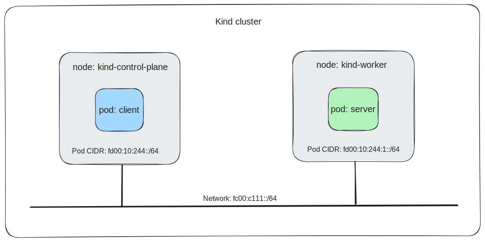

# Cilium IPv6 for Kubernetes

Cilium is at the forefront of leveraging eBPF to provide advanced networking, observability, and security. This demo will dive into how Cilium harnesses the power of eBPF to provide seamless IPv6 networking for Kubernetes clusters, offering features such as IPv6 address management, network policy enforcement, and observability.

The demo uses [Kind](https://kind.sigs.k8s.io/) to create a 2-node Kubernetes cluster configured for IPv6. The following diagram provides additional details of the demo environment:


## Dependencies

The following dependencies must be met for the demo to run properly:

1. [kubectl](https://kubernetes.io/docs/tasks/tools/)
2. Docker daemon with [IPv6 enabled](https://docs.cilium.io/en/stable/contributing/development/dev_setup/#optional-docker-and-ipv6)
3. [Kind](https://kind.sigs.k8s.io/)
4. [Make](https://www.gnu.org/software/make/)
5. [jq](https://jqlang.github.io/jq/)
6. [Cilium CLI](https://docs.cilium.io/en/latest/gettingstarted/k8s-install-default/#install-the-cilium-cli)
7. [Hubble Client](https://docs.cilium.io/en/latest/gettingstarted/hubble_setup/#install-the-hubble-client)
8. Clone the Cilium repo: `git clone https://github.com/cilium/cilium.git && cd cilium`

## Install Kubernetes

Create the Kind cluster:

```sh
IPFAMILY=ipv6 make kind
```

After the cluster is installed, verify the IPv6 configuration of the Kubernetes control plane:

```sh
kubectl get po/kube-controller-manager-kind-control-plane -n kube-system -o yaml | grep -e service-cluster -e cluster-cidr
```

Nodes will be assigned a Pod CIDR from the `--cluster-cidr` CIDR and services will be assigned IPs from the `--service-cluster-ip-range` CIDR.

Verify that nodes were assigned IPv6 pod CIDRs:

```sh
for node in kind-control-plane kind-worker; do
  echo "$node pod CIDRs:"
  kubectl get nodes $node -o go-template --template='{{range .spec.podCIDRs}}{{printf "%s\n" .}}{{end}}'
done
```

Verify that nodes were assigned IPv6 addresses:

```sh
kubectl get nodes -o wide
```

Nodes are assigned an IP from the Docker network created by Kind:

```sh
docker network inspect kind-cilium
```

## Install Cilium in the cluster

Install Cilium:

```sh
cilium install --version v1.15.1 \
  --set debug.enabled=true \
  --set ipv4.enabled=false \
  --set ipv6.enabled=true \
  --set routingMode=native \
  --set autoDirectNodeRoutes=true \
  --set ipv6NativeRoutingCIDR=fd00:10::/32 \
  --set bpf.masquerade=true \
  --set kubeProxyReplacement=true
```

* `routingMode` uses host routing instead of a tunnel overlay for node-to-node routing.
* `ipv6NativeRoutingCIDR` defines the source IP addresses that should *not* be masqueraded. The CIDR should cover the pod and service CIDRs to ensure that traffic to those destinations are not masqueraded by Cilium agent.
* `autoDirectNodeRoutes` allows nodes to learn about routes to pod CIDRs of other nodes.

Wait for Cilium to report a "ready" status:

```sh
cilium status --wait
```

Cilium is now running in the cluster. Verify the routing table of the control plane node:

```sh
docker exec kind-control-plane ip -6 route | grep "fd00:10:244:1::/64"
```

Verify the routing table of the worker node:

```sh
docker exec kind-worker ip -6 route | grep "fd00:10:244::/64"
```

You are now ready to run workloads in the cluster.

## Run Sample Apps

Run client and server pods to use for testing IPv6 connectivity. Node selectors are used as a simple mechanism to schedule client and server pods to different nodes:

```sh
kubectl apply -f - <<EOF
apiVersion: v1
kind: Pod
metadata:
  name: client
  labels:
    app: client
spec:
  containers:
  - name: curl-client
    image: curlimages/curl
    imagePullPolicy: IfNotPresent
    command: ["/bin/sh"]
    args: ["-c", "while true; do sleep 1000; done"]
  nodeSelector:
    kubernetes.io/hostname: kind-control-plane
---
apiVersion: v1
kind: Pod
metadata:
  name: server
  labels:
    app: server
spec:
  containers:
  - name: server
    image: nginx
    imagePullPolicy: IfNotPresent
    ports:
    - containerPort: 80
  nodeSelector:
    kubernetes.io/hostname: kind-worker
EOF
```

Wait for the client pods to reach a `Running` status:

```sh
$ kubectl get po -o wide
NAME     READY   STATUS    RESTARTS   AGE   IP                    NODE                 NOMINATED NODE   READINESS GATES
client   1/1     Running   0          23s   fd00:10:244::6321     kind-control-plane   <none>           <none>
server   1/1     Running   0          23s   fd00:10:244:1::7c58   kind-worker          <none>           <none>
```

Cilium is configured with the Kubernetes host-scope IPAM mode, delegating the IPv6 address allocation to each individual node in the cluster. IPs are allocated from the PodCIDR range associated to each node by Kubernetes.

Set the environment variable that will be used to represent the IPv6 address of the server pod:

Test network connectivity between the pods:

```sh
kubectl exec po/client -- curl -6 -s -o /dev/null -w "%{http_code}" http://[fd00:10:244:1::7c58]
```

You should receive a `200` HTTP status code.

Expose the server pod using a ClusterIP service:

```sh
kubectl expose po server --type=ClusterIP --port=80 --labels app=server
```

Review the service details:

```sh
$ kubectl describe svc/server
Name:              server
Namespace:         default
Labels:            app=server
Annotations:       <none>
Selector:          app=server
Type:              ClusterIP
IP Family Policy:  SingleStack
IP Families:       IPv6
IP:                fd00:10:96::b611
IPs:               fd00:10:96::b611
Port:              <unset>  80/TCP
TargetPort:        80/TCP
Endpoints:         [fd00:10:244:1::7c58]:80
Session Affinity:  None
Events:            <none>
```

The `IP Family Policy` and `IP Families` allows the service to operate in networks that use both IPv4 and IPv6.

* `IP Family Policy`: Indicates how IP families (IPv4 and IPv6) are used by this service. The SingleStack policy means the service uses only one IP family, which in our case is IPv6.

* `IP Families`: Lists the IP protocol families that the service supports. In our case, IPv6 indicates that this service is configured to use only IPv6 addresses. If our cluster and service were configured to use dual-stack, you would see both IPv4 and IPv6 listed here.

Test network connectivity from the client pod to the server pod through the service:

```sh
kubectl exec po/client -- curl -6 -s -o /dev/null -w "%{http_code}" http://[fd00:10:96::b611]
```

You should receive a `200` HTTP status code.

Test network connectivity from the client to the server through the service using DNS:

```sh
$ kubectl exec po/client -- curl -6 -s -vvv http://server.default.svc
* Host server.default.svc:80 was resolved.
* IPv6: fd00:10:96::b611
* IPv4: (none)
*   Trying [fd00:10:96::b611]:80...
* Connected to server.default.svc (fd00:10:96::11b6) port 80
> GET / HTTP/1.1
> Host: server.default.svc
> User-Agent: curl/8.6.0
> Accept: */*
>
< HTTP/1.1 200 OK
...
```

You see the DNS name was resolved to the IPv6 address of the service and the HTTP connection was successful.

## Hubble

[Hubble][] provides observability into networked communication in a completely transparent manner using eBPF. Enable Hubble to begin observing traffic between client and server pods:

```sh
cilium hubble enable
```

__Note:__ You can include the `--ui` flag to enable the Hubble GUI.

Run `cilium status` to verify that Hubble is running:

```sh
cilium status --wait
```

Do not proceed until the `hubble-relay` deployment is running.

In a separate terminal, forward the Hubble relay port to your local machine:

```sh
cilium hubble port-forward
```

In a separate terminal, start observing client<->server HTTP flows with Hubble:

```sh
hubble observe --ipv6 --pod server --protocol tcp -f
```

Return to the original terminal and create a client->server connection:

```sh
kubectl exec po/client -- curl -6 -s -o /dev/null -w "%{http_code}" http://[fd00:10:244:1::7c58]
```

From the previous terminal, observe the HTTP flows:

```sh
Mar 13 22:39:55.442: default/client:37446 (ID:30324) -> default/server:80 (ID:6504) to-endpoint FORWARDED (TCP Flags: SYN)
Mar 13 22:39:55.442: default/client:37446 (ID:30324) -> default/server:80 (ID:6504) to-endpoint FORWARDED (TCP Flags: ACK)
Mar 13 22:39:55.443: default/client:37446 (ID:30324) -> default/server:80 (ID:6504) to-stack FORWARDED (TCP Flags: SYN)
Mar 13 22:39:55.443: default/client:37446 (ID:30324) -> default/server:80 (ID:6504) to-stack FORWARDED (TCP Flags: ACK)
Mar 13 22:39:55.443: default/client:37446 (ID:30324) -> default/server:80 (ID:6504) to-endpoint FORWARDED (TCP Flags: ACK, PSH)
Mar 13 22:39:55.443: default/client:37446 (ID:30324) -> default/server:80 (ID:6504) to-stack FORWARDED (TCP Flags: ACK, PSH)
Mar 13 22:39:55.443: default/client:37446 (ID:30324) -> default/server:80 (ID:6504) to-endpoint FORWARDED (TCP Flags: ACK, FIN)
Mar 13 22:39:55.443: default/client:37446 (ID:30324) -> default/server:80 (ID:6504) to-endpoint FORWARDED (TCP Flags: ACK)
Mar 13 22:39:55.443: default/client:37446 (ID:30324) -> default/server:80 (ID:6504) to-stack FORWARDED (TCP Flags: ACK, FIN)
```

The output shows the client<->server network flows captured by Hubble. Each line represents a flow event, detailing interactions between the client and server pods:

* The format `timestamp: namespace/pod:port (ID:identity) -> namespace/pod:port (ID:identity)` provides the context of the flow.
* `to-stack` and `to-endpoint` indicate the direction of the traffic (towards the network stack or a specific endpoint).
* `FORWARDED` shows the flow status, indicating successful packet transmission.
* `TCP Flags` indicate the state of the TCP connection (e.g., SYN, ACK, FIN, PSH).

__Note:__ Add the `--ip-translation=false` flag to display pod IPs instead of names.

## Network Policy

Cilium [network policy][cnp] is a powerful and flexible way to enforce security rules and segment network traffic for containerized applications at the application and API protocol level using eBPF. It allows administrators to define both allow and deny rules based on Kubernetes labels, pod identities, and even Layer 7 properties, enabling fine-grained control over who can communicate with whom, and how, within a Kubernetes cluster.

To demonstrate network policy, first create another client workload.

```sh
kubectl apply -f - <<EOF
apiVersion: v1
kind: Pod
metadata:
  name: client2
  labels:
    app: client2
spec:
  containers:
  - name: curl-client
    image: curlimages/curl
    imagePullPolicy: IfNotPresent
    command: ["/bin/sh"]
    args: ["-c", "while true; do sleep 1000; done"]
  nodeSelector:
    kubernetes.io/hostname: kind-control-plane
EOF
```

Wait for the client2 pod to reach a `Running` status:

```sh
$ kubectl get po -o wide
NAME     READY   STATUS    RESTARTS   AGE   IP                    NODE                 NOMINATED NODE   READINESS GATES
client   1/1     Running   0          23s   fd00:10:244::6321     kind-control-plane   <none>           <none>
client2   1/1     Running   0          68s   fd00:10:244::cc9d    kind-control-plane   <none>           <none>
server   1/1     Running   0          23s   fd00:10:244:1::7c58   kind-worker          <none>           <none>
```

Test client2->server connectivity:

```sh
kubectl exec po/client2 -- curl -6 -s -o /dev/null -w "%{http_code}" http://[fd00:10:244:1::7c58]
```

You should receive a `200` HTTP status code.

Apply a network policy that only allows `TCP:80` traffic to ingress the server from
the client pod:

```sh
kubectl apply -f - <<EOF
apiVersion: "cilium.io/v2"
kind: CiliumNetworkPolicy
metadata:
  name: demo
spec:
  endpointSelector:
    matchLabels:
      app: server
  ingress:
  - fromEndpoints:
    - matchLabels:
        app: client
    toPorts:
    - ports:
      - port: "80"
        protocol: TCP
EOF
```

Test client->server connectivity:

```sh
kubectl exec po/client -- curl -6 -s -o /dev/null -w "%{http_code}" http://[fd00:10:244:1::7c58]
```

You should receive a `200` HTTP status code.

Test client2->server connectivity:

```sh
kubectl exec po/client2 -- curl -6 -s -o /dev/null -w "%{http_code}" http://[fd00:10:244:1::7c58]
```

The connection should hang since the network policy is being enforced by Cilium. This can be verified using Hubble:

```
Mar 14 16:53:01.240: default/client:50584 (ID:63530) -> default/server:80 (ID:7156) to-endpoint FORWARDED (TCP Flags: ACK)
Mar 14 16:53:01.240: default/client:50584 (ID:63530) <- default/server:80 (ID:7156) to-endpoint FORWARDED (TCP Flags: ACK, PSH)
...
Mar 14 16:53:02.772: default/client2:49558 (ID:52749) -> default/server:80 (ID:7156) to-network FORWARDED (TCP Flags: SYN)
Mar 14 16:53:02.773: default/client2:49558 (ID:52749) <> default/server:80 (ID:7156) policy-verdict:none INGRESS DENIED (TCP Flags: SYN)
Mar 14 16:53:02.773: default/client2:49558 (ID:52749) <> default/server:80 (ID:7156) Policy denied DROPPED (TCP Flags: SYN)
...
```

The flow events indicate traffic is forwarded between client and server. The client2->server traffic is forwarded to the network stack but then dropped due to the network policy.

## BIG TCP

IPv6 BIG TCP allows the networking stack to handle larger transmit and receive packets (192k). This reduces the number of times the stack is traversed which improves performance and latency. It reduces the CPU load and helps achieve higher speeds.

Verify that IPv6 BIG TCP is disabled:

```sh
$ cilium config view | grep big
enable-ipv6-big-tcp                            false
```

Ensure the kernel is >= 5.19:

```sh
uname -r
```

Verify the GSO setting of the nodes:

```sh
for node in kind-control-plane kind-worker; do
  echo "$node gso_max_size:"
  docker exec $node ip -d -j link show dev eth0 | jq -c '.[0].gso_max_size'
done
```

You should receive the following output:

```sh
kind-control-plane gso_max_size:
65536
kind-worker gso_max_size:
65536
```

The maximum size of the GSO is 64KB since BIG TCP is not enabled.

Create a netperf client and server to establish a network throughput baseline:

```sh
kubectl apply -f - <<EOF
apiVersion: v1
kind: Pod
metadata:
  name: np-server
spec:
  containers:
  - name: netperf
    image: cilium/netperf
    imagePullPolicy: IfNotPresent
    ports:
    - containerPort: 12865
  nodeSelector:
    kubernetes.io/hostname: kind-worker
---
apiVersion: v1
kind: Pod
metadata:
  name: np-client
spec:
  containers:
  - name: netperf
    args:
    - sleep
    - infinity
    image: cilium/netperf
    imagePullPolicy: IfNotPresent
  nodeSelector:
    kubernetes.io/hostname: kind-control-plane
EOF
```

__Note__: The image used in the above manifest is for x86 architectures. Replace with `younglook/netperf-arm64` to run on ARM 64-bit architectures.

Get the IPs of the netperf client and server pods:

```sh
$ kubectl get po -o wide
NAME        READY   STATUS    RESTARTS   AGE   IP                    NODE                 NOMINATED NODE   READINESS GATES
np-client   1/1     Running   0          31s   fd00:10:244::96       kind-control-plane   <none>           <none>
np-server   1/1     Running   0          31s   fd00:10:244:1::35b7   kind-worker          <none>           <none>
...
```

Run a netperf test:

```sh
kubectl exec np-client -- netperf  -t TCP_RR -H fd00:10:244:1::35d7 -- -r80000:80000 -O MIN_LATENCY,P90_LATENCY,P99_LATENCY,THROUGHPUT
```

The test should complete with output similar to the following:

```sh
MIGRATED TCP REQUEST/RESPONSE TEST from ::0 (::) port 0 AF_INET6 to fd00:10:244:1::35d7 () port 0 AF_INET6 : first burst 0
Minimum      90th         99th         Throughput
Latency      Percentile   Percentile
Microseconds Latency      Latency
             Microseconds Microseconds
86           160          247          7515.80
```

The netperf test results show performance metrics for a TCP request/response test between two pods across different nodes in your Kubernetes cluster. Here's the summary:

* Minimum Latency: The shortest round-trip time (RTT) for a single request-response was 86 microseconds. This represents the best-case scenario.

* 90th Percentile Latency: 90% of the request-response interactions experienced a latency of 160 microseconds or less. This gives a sense of the typical upper-bound latency under normal conditions.

* 99th Percentile Latency: 99% of the interactions were completed within 247 microseconds, indicating the near-worst-case latency observed during the test.

* Throughput: The test achieved a throughput of 7515.80 transactions per second (TPS), reflecting the number of successful request-response cycles per second under the test conditions.

Enable IPv6 BIG TCP:

```sh
cilium config set enable-ipv6-big-tcp true
```

Wait for Cilium to report a "ready" status:

```sh
cilium status --wait
```

Pods need to be restarted for the BIG TCP setting to take effect. Forcefully delete the netperf pods:

```sh
kubectl delete po/np-client --force
kubectl delete po/np-server --force
```

After using the above manifests to start new netperf client and server pods, get the new IP of the `np-server` pod:

```sh
$ kubectl get po/np-server -o wide
NAME        READY   STATUS    RESTARTS   AGE     IP                    NODE          NOMINATED NODE   READINESS GATES
np-server   1/1     Running   0          3m21s   fd00:10:244:1::e32e   kind-worker   <none>           <none>
```

Verify the GSO setting of the nodes have increased to 192KB:

```sh
for node in kind-control-plane kind-worker; do   echo "$node gso_max_size:";   docker exec $node ip -d -j link show dev eth0 | jq -c '.[0].gso_max_size'; done
```

You should receive the following output:

```sh
kind-control-plane gso_max_size:
196608
kind-worker gso_max_size:
196608
```

Rerun the test:

```sh
kubectl exec np-client -- netperf  -t TCP_RR -H fd00:10:244:1::e32e -- -r80000:80000 -O MIN_LATENCY,P90_LATENCY,P99_LATENCY,THROUGHPUT
```

Your results should be similar to the following output:

```sh
MIGRATED TCP REQUEST/RESPONSE TEST from ::0 (::) port 0 AF_INET6 to fd00:10:244:1::e32e () port 0 AF_INET6 : first burst 0
Minimum      90th         99th         Throughput
Latency      Percentile   Percentile
Microseconds Latency      Latency
             Microseconds Microseconds
45           106          152          14370.36
```

Compare the numbers from the previous test and you will see that the latency and throughput increased dramatically.

Congratulations on completing the demo! I hope you enjoyed your experience and improved your knowledge of Cilium. If you find any errors or areas of improvement, please submit a pull request.

[Hubble]: https://docs.cilium.io/en/latest/gettingstarted/hubble_intro/
[cnp]: https://docs.cilium.io/en/stable/network/kubernetes/policy/#ciliumnetworkpolicy
